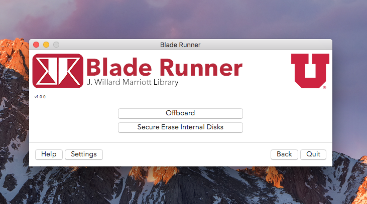
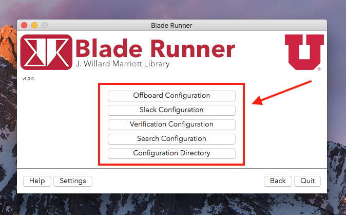
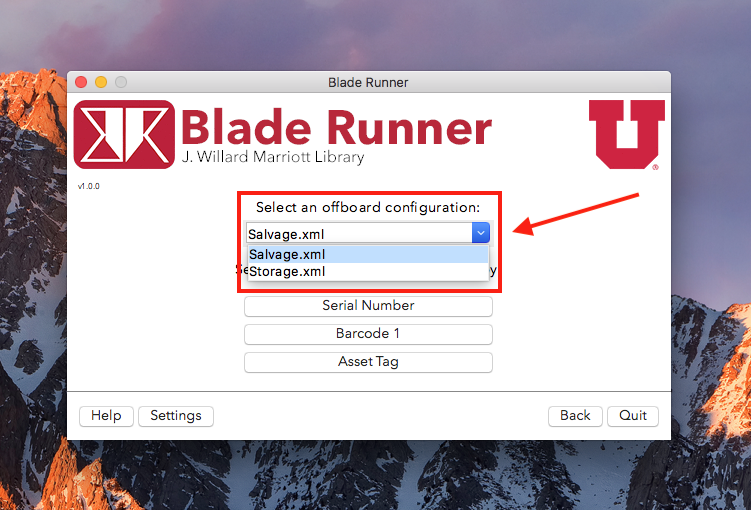
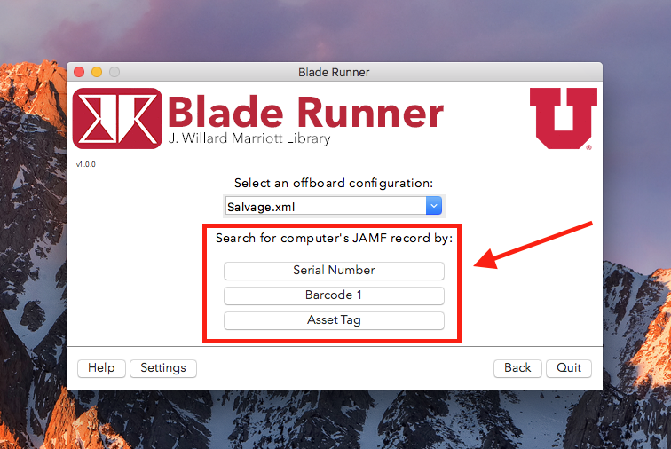
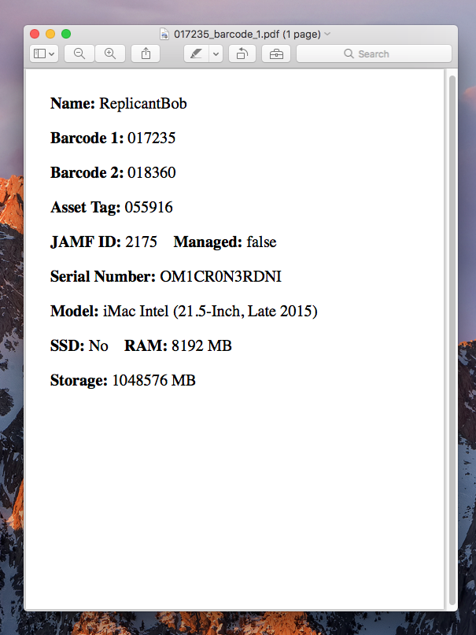
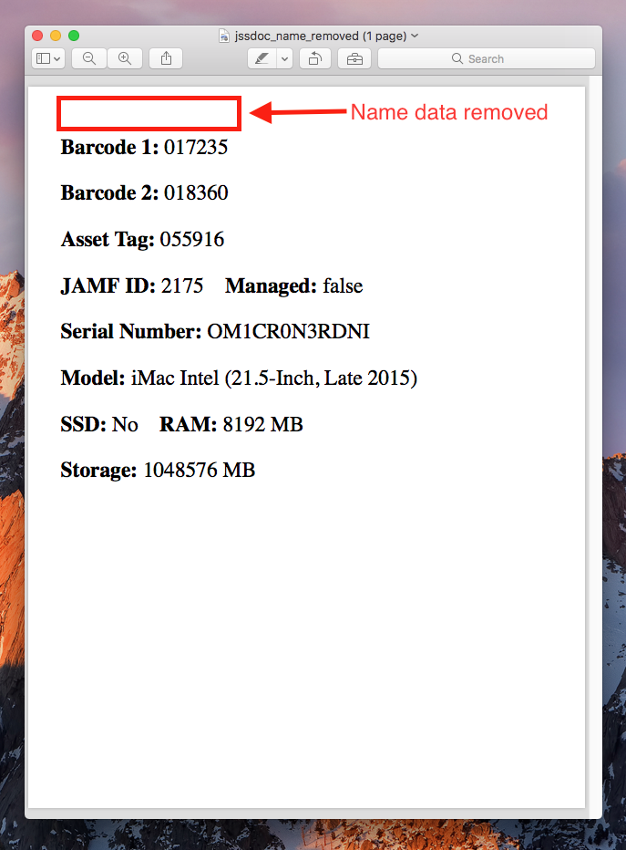
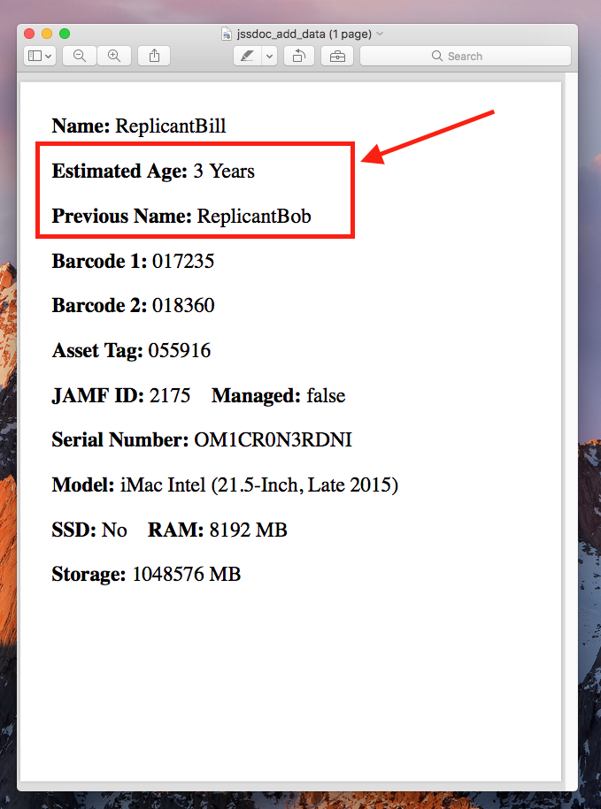
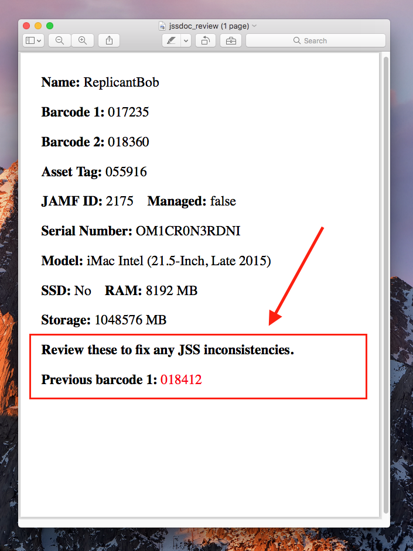

Blade Runner
===========


*Blade Runner* is a Jamf Pro based Python application that automates and implements a framework to offboard, secure erase and document deprecated Mac systems.



It is configured through property list (plist) files and Extensible Markup Language (XML) files, allowing for multiple offboarding configurations, a dynamically updating GUI, Slack integration, and specification of which search terms can be used to locate/update a Jamf Pro record.

For a list of features, see [Features & How They Work](#features-and-how-they-work).

# Contents

* [Important Items Before You Start](#important-items-before-you-start)
* [Download](#download)
* [System Requirements](#system-requirements)
* [Configuration](#configuration)
    * [Jamf Pro Configuration](#jamf-pro-configuration)
    * [Offboard Configuration](#offboard-configuration)
    * [Search Parameters Configuration](#search-parameters-configuration)
    * [Verification Parameters Configuration](#verification-parameters-configuration)
    * [Print Configuration](#print-configuration)
    * [Python Binary Configuration](#python-binary-configuration)
    * [User Defined Actions](#user-defined-actions)
* [Testing](#testing)
* [Features & How They Work](#features-and-how-they-work)
    * [Offboard](#offboard)
    * [Enroll](#enroll)
    * [Secure Erase](#secure-erase)
        * [Firmware Password Detection](#firmware-password-detection)
        * [Internal Disks Detection & Erasure](#internal-disks-detection-and-erasure)
        * [Secure Erase Verification Tests](#secure-erase-verification-tests)
        * [Internal CoreStorage Detection & Dismantling](#internal-corestorage-detection-and-dismantling)
        * [Secure Erase Error Recovery](#secure-erase-error-recovery)
    * [Slack Notifications](#slack-notifications)
        * [Slack Reminder Daemon](#slack-notifications)   
    * [Auto Document Generation and Printing](#auto-document-generation-and-printing)
        * [Displays Inconsistencies in Jamf Pro Record](#jamf-pro-record-inconsistencies) 
* [Uninstallation](#uninstallation)
* [Contact](#contact)
* [Update History](#update-history)

# Important Items Before You Start

1. Test Blade Runner on a non-production Jamf Pro until you feel comfortable with it. The easiest way to do this is to set up Jamf Pro on a virtual machine.
2. Create a limited API user that Blade Runner will use to interface with Jamf Pro. The user name and credentials that Blade Runner uses are stored in an unencrypted configuration file.
3. Blade Runner needs Python 2 with a version greater than or equal to 2.7.9. If the OS that is running Blade Runner has a Python version less than 2.7.9, a quick fix is to install [Anaconda Python 2.7 version](https://www.anaconda.com/distribution/) on the OS and point *Blade Runner*'s `python_bin.plist` file to Anaconda's Python 2 binary. 

# Download

The latest release is available for download [here](../../releases). 
Uninstallation instructions are provided [below](#uninstallation). 

# System Requirements

*Blade Runner* requires Python 2.7.9 or greater, excluding Python 3. It must be run on a Mac operating system (OS), and has been tested on Mac OS X 10.9 (Mavericks) through macOS 10.14 (Mojave).

# Configuration

*Blade Runner* is configured through plist and XML files. These configuration files are used for Jamf Pro access, Slack notifications, and *Blade Runner* itself. The configuration files can be accessed through *Blade Runner*'s `Settings` menu, and all must be configured before running *Blade Runner*.



* [Jamf Pro Configuration](#jamf-pro-configuration)
* [Offboard Configuration](#offboard-configuration)
* [Search Parameters Configuration](#search-parameters-configuration)
* [Verification Parameters Configuration](#verification-parameters-configuration)
* [Print Configuration](#print-configuration)
* [Python Binary Configuration](#python-binary-configuration)
* [User Defined Actions](#user-defined-actions)

## Jamf Pro Configuration

The `jamf_pro.plist` file contains the information needed for *Blade Runner* to perform Jamf Pro related tasks. The config contains the following keys:

* **username**
  * Jamf Pro login username that will be used to make API requests to Jamf Pro. 
* **password**
  * Jamf Pro login password that will be used to make API requests to Jamf Pro.
* **jss_url**
  * Jamf Pro url.
* **invite**
  * Invitation code used to enroll a computer into Jamf Pro. 
* **jamf_binary_1**
  * Location of `jamf` binary on computer. This is the primary `jamf` binary that will be used to enroll computers.
* **jamf_binary_2**
  * Secondary `jamf` binary location. Intended to be a location on an external hard drive, e.g., `/Volumes/my_external_drive/jamf` in the case that the computer being enrolled doesn't have a `jamf` binary.

### Example Configurations

```xml
<?xml version="1.0" encoding="UTF-8"?>
<!DOCTYPE plist PUBLIC "-//Apple//DTD PLIST 1.0//EN" "http://www.apple.com/DTDs/PropertyList-1.0.dtd">
<plist version="1.0">
<dict>
	<key>username</key>
	<string>user1234</string>
	<key>password</key>
	<string>secret_pass123</string>
	<key>jss_url</key>
	<string>https://my.jamf.server.domain:portnumber</string>
	<key>invite</key>
	<string>1234567891234567891234567891234567890</string>
	<key>jamf_binary_1</key>
	<string>/usr/local/bin/jamf</string>
	<key>jamf_binary_2</key>
	<string>/Volumes/my_external_drive/jamf</string>
</dict>
</plist>
```

## Offboard Configuration

Offboard configurations can have any name but must be listed in the XML configuration files. These configurations will contain the information to be sent to Jamf Pro during the offboarding process. As seen below, all offboard configurations will be available to the user. These configs are located in `config/offboard_configs` and can also be accessed through `Settings`.




**NOTE: The XML file must represent a valid string for Jamf Pro's XML API calls.** The best way to check this is to go to `https://my.jamf.server.domain:portnumber/api`, click on `computers>computers/id>Try it out!`, and look at the available data in `XML Response Body`. Your configuration file's tags and structure should only contain tags that exist in `XML Response Body`.

### Example Configurations

* Offboard configuration that only sets management status to false:
```xml
<computer>
  <general>
    <remote_management>
      <managed>false</managed>
    </remote_management>
  </general>
</computer>
```

* Offboard configuration that sets management status to false and clears all location fields:
```xml
<computer>
  <general>
    <remote_management>
      <managed>false</managed>
    </remote_management>
  </general>
  <location>
    <username></username>
    <realname></realname>
    <real_name></real_name>
    <email_address></email_address>
    <position></position>
    <phone></phone>
    <phone_number></phone_number>
    <department></department>
    <building></building>
    <room></room>
  </location>
</computer>
```

* Offboard configuration that sets management status to false and updates an extension attribute (extension attributes differ between Jamf Pro servers):
```xml
<computer>
  <general>
    <remote_management>
      <managed>false</managed>
    </remote_management>
  </general>
  <extension_attributes>
    <extension_attribute>
      <id>12</id>
      <name>Inventory Status</name>
      <type>String</type>
      <value>Storage</value>
    </extension_attribute>
  </extension_attributes>
</computer>
```

## Search Parameters Configuration

The `search_params.plist` file determines the search parameters that can be used to find a computer record in Jamf Pro. The Blade Runner GUI will dynamically update search parameters by only showing buttons that correspond to the enabled parameters.

The available search parameters are `serial number`, `barcode 1`, `barcode 2`, and `asset tag`.


### Example Configuration

* The example configuration below updates the Blade Runner GUI to show barcode 1, asset tag, and serial number buttons and allows the user to search Jamf Pro using the included search parameters:
```xml
<?xml version="1.0" encoding="UTF-8"?>
<!DOCTYPE plist PUBLIC "-//Apple//DTD PLIST 1.0//EN" "http://www.apple.com/DTDs/PropertyList-1.0.dtd">
<plist version="1.0">
<dict>
	<key>barcode_1</key>
	<string>True</string>
	<key>barcode_2</key>
	<string>False</string>
	<key>asset_tag</key>
	<string>True</string>
	<key>serial_number</key>
	<string>True</string>
</dict>
</plist>
```



## Verification Parameters Configuration

The `verify_params.plist` file determines which search parameters need to be verified when a match in Jamf Pro is found. It is generally the case that any keys enabled in [search_params.plist](#search-parameters-configuration) should also be enabled in `verify_config.plist`.

Here's a short example scenario of how *Blade Runner* handles user entered data when a match is found:

* User searches for a computer using `barcode 1`:
  * No match found.
    * User then searches for a computer using `asset tag`:
      * Match found.
        * If `barcode 1` and `asset_tag` are enabled in `verify_params.plist`, *Blade Runner* will ask the user to verify/correct the information entered for `barcode 1` and `asset_tag` against Jamf Pro's record.


## Print Configuration

The `print.plist` file determines if generated documents will be printed upon creation to the default printer.

```xml
<?xml version="1.0" encoding="UTF-8"?>
<!DOCTYPE plist PUBLIC "-//Apple//DTD PLIST 1.0//EN" "http://www.apple.com/DTDs/PropertyList-1.0.dtd">
<plist version="1.0">
<dict>
	<key>print</key>
	<string>False</string>
</dict>
</plist>
```

## Python Binary Configuration

The `python_bin.plist` file allows for specifying the Python binary to use for *Blade Runner*. 

```xml
<?xml version="1.0" encoding="UTF-8"?>
<!DOCTYPE plist PUBLIC "-//Apple//DTD PLIST 1.0//EN" "http://www.apple.com/DTDs/PropertyList-1.0.dtd">
<plist version="1.0">
<dict>
	<key>python_binary</key>
	<string>/usr/bin/python</string>
</dict>
</plist>
```

An attempt to use the specified binary will be made, but if the attempt fails, *Blade Runner* will attempt to use the following binaries if they exist and if their version is 2.7.9 or greater (excluding Python 3): 

    /usr/bin/python2.7
    /usr/bin/python
    /anaconda2/bin/python2

## User Defined Actions

There are areas in *Blade Runner*'s codebase where a custom implementation of a process may be needed. In such circumstances, a configuration file isn't sufficient and the code needs to be supplemented.

To facilitate "knowing" where to put this code, `user_actions.py` is provided. It contains three unimplemented functions that are called regardless of implementation.

### modify_items

`user_actions.py` contains an unimplemented function named `modify_items()`. This function is called in [jss_doc.py](#auto-document-generation-and-printing). It appears right before the body of the document is generated. Its purpose is to allow the user to modify the data that appears in the document. `modify_items()` takes the `JssDoc`'s `self` as the first parameter and a list of tuples as the second parameter. `self` provides access to Jamf Pro. Each tuple in the list
contains the name and value of the data to be added to the document.

The first parameters of the standard data tuples are the following:

    * Name
    * Barcode 1
    * Barcode 2
    * Asset Tag
    * Jamf ID
    * Serial Number
    * Model
    * SSD
    * RAM
    * Storage
    
and produce a document like this:



#### Remove Example  
An implementation to **remove** the `Name` tuple would look like this:

```python
# user_actions.py

def modify_items(self, items):
    # Remove Name tuple from the list
    items.pop(0)
```

and would result in a document like this:



#### Add Example:
An implementation to **add** some custom data tuples might look like this:

```python
# user_actions.py

def modify_items(self, items):
    # Getting an extension attribute by its name from the server.
    estimated_age = self.jss_server.get_extension_attribute(self.computer.jss_id, name="Estimated Age")
    
    # Getting an extension attribute by its ID from the server.
    prev_name = self.jss_server.get_extension_attribute(self.computer.jss_id, id="46")
    
    items.insert(1, ("Estimated Age", estimated_age))
    items.insert(2, ("Previous Name", prev_name))
```

and would result in a document like to this:



### update_offboard_config

`user_actions.py` contains an uimplemented function `update_offboard_config()` that is called before *Blade Runner* sends the offboard config to Jamf Pro. Its purpose is to make custom changes to the offboard data before it is sent.

#### Example

Given an offboard config like this:

```xml
<computer>
    <general>
        <name></name>
        <remote_management>
            <managed>false</managed>
        </remote_management>
    </general>
</computer>
``` 
an implementation to always change the name to the serial number would look like this:

```python
# user_actions.py
import xml.etree.cElementTree as ET

def update_offboard_config(self):
    # Parse the XML string into an XML tree and get the root.
    xml_root = ET.fromstring(self._offboard_config)

    # Find the "name" tag in "general" and replace its value with the serial number.
    for general_element in xml_root.findall("./general"):
        name_element = general_element.find('name')
        name_element.text = self._computer.serial_number

    # Save the new XML string.
    self._offboard_config = ET.tostring(xml_root)
```

### update_slack_message

`user_actions.py` contains an unimplemented function named `update_slack_message().` This function is called right before the Slack message is sent.

An implementation that appends the serial number to the Slack message would look like this:

```python
def update_slack_message(self, message):
    message += " Serial: {}".format(self._computer.serial_number)
    return message
```

# Testing

Testing should be done on a non-production Jamf Pro. It's recommended that the non-production Jamf Pro be set up on a virtual machine (VM). You can follow this [tutorial](https://apple.lib.utah.edu/jamf-pro-in-a-virtual-box/) for setting up Jamf Pro on a MacOS VM.

To manually test *Blade Runner*, configure the files in `Blade\ Runner.app/Contents/Resources/Blade\ Runner/test/config` and run `test_blade_runner_manual.py`. Don't use *Blade Runner*'s settings button to open these files, as the settings button opens the non-test configuration files. To run `test_blade_runner_manual.py`, change the working directory to `Blade\ Runner.app/Contents/Resources/Blade\ Runner/` and do:

```bash
sudo python test/test_blade_runner_manual.py
```

This will run *Blade Runner* using your test configuration files.

NOTE: If the `jamf` command hangs on `softwareupdate` when enrolling, go to `Settings>Computer Management>Inventory Collection>General` in Jamf Pro and uncheck `Include home directory sizes`. You can also uncheck `Collect available software updates` for the purpose of testing.

# Features and How They Work

*Blade Runner* essentially performs 5 tasks:

    1. Offboard
    2. Enroll
    3. Secure Erase
        i. Firmware Password Detection
       ii. Internal Disks Detection & Erasure
      iii. Secure Erase Verification Tests
       iv. Internal CoreStorage Detection & Dismantling
        v. Secure Erase Error Recovery
    4. Auto Document Generation & Printing
    5. Slack Notifications
        i. Slack Reminder Daemon
    
## Offboard

Offboarding is done through API calls made by *Blade Runner* to Jamf Pro. The user selects an [offboarding configuration file](#offboard-configuration) and that file is sent as an XML string to Jamf Pro.

## Enroll

The purpose of enrolling before offboarding is to:

1. create a record for a computer if it doesn't already exist in Jamf Pro.
2. change the managed status of an existing computer from false to true. This enables modification of the computer record.

Enrolling is done through the `jamf` binary with an invitation code: 

    jamf enroll -invitation 1234567891234567891234567891234567890 -noPolicy -noManage -verbose

The invitation code is set in the [Jamf Pro configuration](#jamf-pro-configuration).

## Secure Erase

The secure erase functionality contains the following features:

    1. Firmware Password Detection.
    2. Internal Disk Detection/Erase
    3. Secure Erase Verification Tests
    4. Internal CoreStorage Detection/Dismantling
    5. Secure Erase Error Recovery
    6. Slack Notifications
    7. Auto Document Generation/Printing.

### Firmware Password Detection

*Blade Runner* uses the `firmwarepasswd` command to check for the existence of a firmware password before secure erasing. This is done to ensure that the firmware password has been removed in the scenario that the computer will be put in storage or sold to another user.

**NOTE:** `firmwarepasswd` command only exists on macOS 10.10 and above. If *Blade Runner* is unable to find `firmwarepasswd`, a pop up will display asking the user to disable the firmware password before continuing. The user can then proceed with the secure erase at their own discretion.

### Internal Disks Detection and Erasure

Internal disk detection is done through `diskutil info -plist disk#`. A plist is returned containing information about the disk. One of the keys in the plist is `Internal`, denoting the internal status of the disk. The disks are then erased with a single-pass zero-fill erase using `diskutil secureErase 0 disk#`.

### Secure Erase Verification Tests

A series of four tests is performed on every disk that is erased. These tests use `diskutil` output to determine if a disk was erased successfully.

* `disktutil verifyDisk disk#`
  * Test 1: If output contains "Nonexistent", "unknown", or "damaged", test passes.
* `diskutil info -plist disk#`
  * Test 2: If the value of `Content` key is `''`, test passes.
  * Test 3: If the length of `AllDisks` key value is `1`, test passes.
  * Test 4: If the length of `VolumesFromDisks` key value is `0`, test passes.

If all four tests pass, the disk has been secure erased.

### Internal CoreStorage Detection and Dismantling

Internal CoreStorage detection is done through `diskutil coreStorage info -plist disk#` and testing for the existence of the `MemberOfCoreStorageLogicalVolumeGroup` key. If the disk contains this key, its lvgUUID is obtained, and is deleted with `diskutil cs delete lvgUUID#`.

### Secure Erase Error Recovery

If an error occurs while attempting a secure erase, a series of steps is taken to recover from and fix the error before attempting another secure erase. The two commons problems that prevent a secure erase are:

1. Inability to unmount disk
2. Inability to work with a disk that needs to be repaired

In these situations, *Blade Runner* first performs a force unmount with `diskutil unmountDisk force disk#` before attempting another secure erase. If this fails, an attempt is made to repair the disk with `diskutil repairVolume disk#` before trying to secure erase a final time.

## Slack Notifications

Slack notifications can be used to indicate the start and end of the process along with any errors that occur in the process. Currently, Slack notifications are reliant on `management_tools`, which is an included dependency.

To help busy or forgetful Mac admins, a Slack reminder daemon has been implemented to remind the admin that a Mac has been offboarded. This daemon will send a message once a day between 9 am and 6 pm, and will continue to do so until addressed. The daemon can be disabled in `slack.plist`.

## Auto Document Generation and Printing

Auto document generation is done in `jss_doc.py` by the `JssDoc` class. This class generates a document by querying Jamf Pro for the following data:

    * Name
    * Barcode 1
    * Barcode 2
    * Asset Tag
    * Jamf ID
    * Serial Number
    * Model
    * SSD
    * RAM
    * Storage

and will create a document like this:


On the code side of things, these fields are represented by tuples, in which the first parameter is the data name and the second parameter is the data value. This is important to know if you plan on [adding to](#add-example) or [removing from](#remove-example) the data above to customize the document.

### Jamf Pro Record Inconsistencies

In the case that inconsistencies exist between user entered data and the Jamf Pro data, they will be added to the document for the user to review later if they so wish.

The reported inconsistencies are as follows:

    * Previous barcode 1
    * Previous barcode 2
    * Previous asset tag
    * Previous serial

For example, if the entered `barcode 1` differs from Jamf Pro's record, the previous `barcode 1` will be displayed:



The intent of this is to help track down and correct other mangled or incorrect computer records.

# Uninstallation

To uninstall, simply delete the application. The only files *Blade Runner* creates outside itself are the documents it generates, which are located in `~/Documents/Blade Runner/`.

# Contact

Issues/bugs can be reported [here](../../issues). If you have any questions or comments, feel free to [email us](mailto:mlib-its-mac-github@lists.utah.edu).

Thanks!

# Update History

| Date       | Version | Description
|------------|:-------:|------------------------------------------------------|
| TBA        | 1.0.0   | Initial Release                                      


